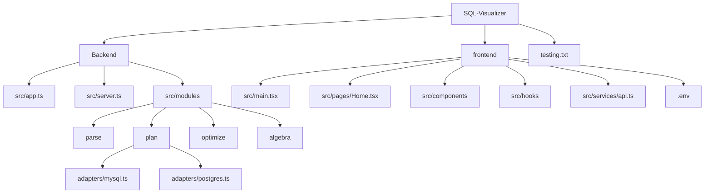

# SQL Visualizer

Interactive SQL query visualizer with a React frontend and Express + TypeScript backend.  
You can run it locally, or host frontend/backend separately (e.g., Vercel + Render).

## Tech Stack

- **Frontend:** React, TypeScript, Vite, Tailwind, React Flow
- **Backend:** Node.js, Express, TypeScript
- **Databases supported for live plans:** PostgreSQL, MySQL

## Project Structure



## Prerequisites

- Node.js 20+ (Node 24 also works)
- npm
- A running PostgreSQL or MySQL database (for real DB plans)

## 1. Clone and Install

```bash
git clone <your-repo-url>
cd SQL-Visualizer
```

Install backend dependencies:

```bash
cd Backend
npm install
```

Install frontend dependencies:

```bash
cd ..\frontend
npm install
```

## 2. Environment Configuration

Set frontend API base URL in `frontend\.env`:

```env
VITE_API_URL=http://localhost:5050
```

If backend is hosted on Render, set:

```env
VITE_API_URL=https://sql-visualizer-hy00.onrender.com
```

## 3. Run Locally

Open **2 terminals**.

Terminal 1 (Backend):

```bash
cd Backend
npm run dev
```

Backend runs on: `http://localhost:5050`

Terminal 2 (Frontend):

```bash
cd frontend
npm run dev
```

Frontend runs on Vite URL (usually `http://localhost:5173`).

## 4. Build Commands

Backend:

```bash
cd Backend
npm run build
npm start
```

Frontend:

```bash
cd frontend
npm run build
```

## 5. How to Use the App

1. Open frontend in browser.
2. Write a SQL query in the editor.
3. Configure DB connection in **Database Connection** panel:
   - Type: `postgres` or `mysql`
   - Host / Port / User / Password / Database
4. Click **Run Query** or **Optimize**.

## 6. Using ngrok for Local DB Tunneling

Use this when backend is hosted (e.g., Render) but database is local on your machine.

### Step A: Install + Authenticate ngrok

```bash
ngrok config add-authtoken <YOUR_NGROK_AUTHTOKEN>
```

### Step B: Start TCP Tunnel

For PostgreSQL (default local port 5432):

```bash
ngrok tcp 5432
```

For MySQL (default local port 3306):

```bash
ngrok tcp 3306
```

You will get an address like:

```text
tcp://0.tcp.in.ngrok.io:19713
```

### Step C: Put Tunnel Values in App DB Config

- **Host:** `0.tcp.in.ngrok.io`
- **Port:** `19713`
- **User / Password / Database:** local DB credentials
- **Type:** postgres/mysql

### Step D: Keep Services Running

- Keep local DB service running
- Keep ngrok terminal running
- If ngrok restarts, host/port may change (free plan) and must be updated in app config

## 7. Database Server Requirements for ngrok

### PostgreSQL

- `postgresql.conf`: `listen_addresses = '*'`
- `pg_hba.conf`: allow remote host auth (for testing)
- Restart PostgreSQL service after changes

### MySQL

- `my.cnf` / `my.ini`: `bind-address = 0.0.0.0`
- Ensure DB user is allowed from remote hosts (e.g., `%`)
- Restart MySQL service after changes

## 8. Common Issues

- **`POST /api/plan/test 400`**: DB config invalid, tunnel changed, DB not reachable, or wrong DB name.
- **Unknown database error**: database name typo.
- **No backend requests from frontend**: missing/wrong `VITE_API_URL` or Vercel env not redeployed.
- **`HEAD / 404` on Render root**: normal if `/` route is not defined.

## 9. Deployment Notes

- Frontend can be hosted on Vercel.
- Backend can be hosted on Render.
- Frontend should call backend through `VITE_API_URL`.
- Backend should connect to DB (direct host or ngrok tunnel host/port).
